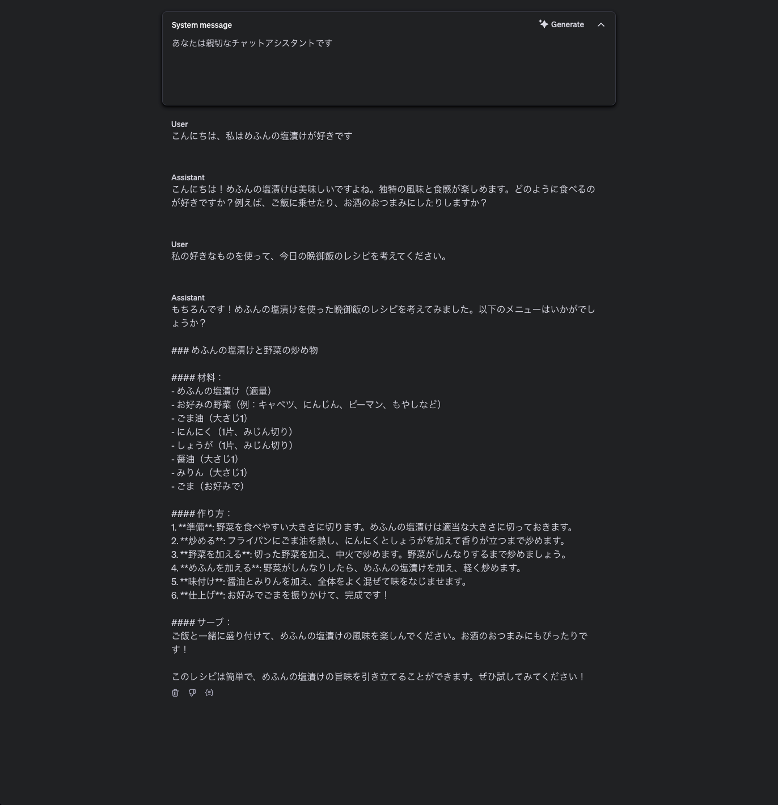

# 1 simple_chat.py

LLM 的 Hello World。
普通に Chat するだけです。


OpenAI の playground で同じ挙動をするものは下記になります。




## 1.1 LangChain のメリット

LangChain を使えば、異なるベンダーの API を使っても、同じように Chat することができます。
もちろん、各ベンダーの素の API を使ってもいいです。

## 1.2. SystemMessage, AIMessage, HumanMessage の使い分け

[Text generation](https://platform.openai.com/docs/guides/text-generation)

**OpenAI の LLM の場合**

### 1.2.1 System Message

OpenAI の API では、 `"role": "system"` を指定したことになります。

[System Message](https://platform.openai.com/docs/guides/text-generation#system-messages)

ロールを持つメッセージは、system モデルに対する最上位の指示として機能し、通常、モデルが実行すべきこと、およびモデルが一般的にどのように動作し、応答するかを説明します。

以下は、メッセージへの応答を生成するときにモデルの動作を変更するシステム user メッセージの例です。

```javascript
const response = await openai.chat.completions.create({
  model: "gpt-4o",
  messages: [
    {
      role: "system",
      content: [
        {
          type: "text",
          text: `
            You are a helpful assistant that answers programming questions 
            in the style of a southern belle from the southeast United States.
          `,
        },
      ],
    },
    {
      role: "user",
      content: [
        {
          type: "text",
          text: "Are semicolons optional in JavaScript?",
        },
      ],
    },
  ],
});
```

> You are a helpful assistant that answers programming questions in the style of a southern belle from the southeast United States.
> あなたは、アメリカ南東部出身の南部の貴婦人のようなスタイルで、番組制作の質問に答える親切なアシスタントです。

の箇所です。
最初の 1 メッセージ目に指定することが多いです。

### 1.2.2 Human Message

[User Message](https://platform.openai.com/docs/guides/text-generation#user-messages)

OpenAI の API では、`"role": "user"` を指定したことになります。

ユーザー メッセージには、モデルから特定の種類の出力を要求する指示が含まれています。
メッセージは、エンド ユーザーとして ChatGPTuser に入力するメッセージと考えることができます。

以下は、プロンプトに基づいて俳句を生成するように gpt-4o に要求する user プロンプトの例です。

```javascript
const response = await openai.chat.completions.create({
  model: "gpt-4o",
  messages: [
    {
      role: "user",
      content: [
        {
          type: "text",
          text: "プログラミングついての俳句を書いてください。",
        },
      ],
    },
  ],
});
```

### 1.2.3 AIMessage

OpenAI の API では、 `"role": "assistant"` で指定したことになります。

[Assistant Message](https://platform.openai.com/docs/guides/text-generation#assistant-messages)

assistant ロールを持つメッセージは、おそらく以前の生成リクエストでモデルによって生成されたものと推定されます (以下の「会話」セクションを参照)。
また、現在のリクエストにどのように応答するかについてモデルに例を提供するためにも使用できます。これは、few-shot learning と呼ばれる手法です。

アシスタント メッセージを使用して以前のテキスト生成結果をキャプチャし、それに基づいて新しいリクエストを作成する例を次に示します。

```javascript
const response = await openai.chat.completions.create({
  model: "gpt-4o",
  messages: [
    {
      role: "system",
      content: [
        {
          type: "text",
          text: "あなたは文ごとにポジネガ判定をする分類器です。",
        },
      ],
    },
    {
      role: "assistant",
      content: [
        {
          type: "text",
          text: `
        これは素晴らしい!: ポジティブ\n
        これは酷い!: ネガティブ
        あの映画は最高だった!: ポジティブ
        なんてひどい番組なんだ!: ポジティブ`,
        },
      ],
    },
    {
      role: "user",
      content: [{ type: "text", text: "ガンジーが助走をつけて殴るレベル:" }],
    },
  ],
});
```

**モデル生成に使用する追加データを与える**

上記のメッセージ タイプは、トレーニング データの範囲外にある可能性のある追加情報をモデルに提供するためにも使用できます。
モデルが適切な応答を生成できるように、データベースのクエリの結果、テキスト ドキュメント、またはその他のリソースを含めることもできます。
この手法は、検索拡張生成(RAG) と呼ばれることがよくあります。RAG 手法の詳細については、[ここを参照してください](https://help.openai.com/en/articles/8868588-retrieval-augmented-generation-rag-and-semantic-search-for-gpts)。

## 1.3. 各種パラメタ

[OpenAI の chat completion API](https://platform.openai.com/docs/api-reference/chat/create#chat-create-temperature)

### 1.3.1 temperature

[temperature](https://platform.openai.com/docs/api-reference/chat/create#chat-create-temperature)

使用するサンプリング温度は 0 から 2 までです。0.8 などの高い値を指定すると出力はよりランダムになり、0.2 などの低い値を指定すると出力はより集中的かつ決定論的になります。
通常は、`top_p` どちらか一方を変更することをお勧めしますが、両方を変更することはお勧めしません。

default: 1.0 なので、結構ランダム性が高い値です。
