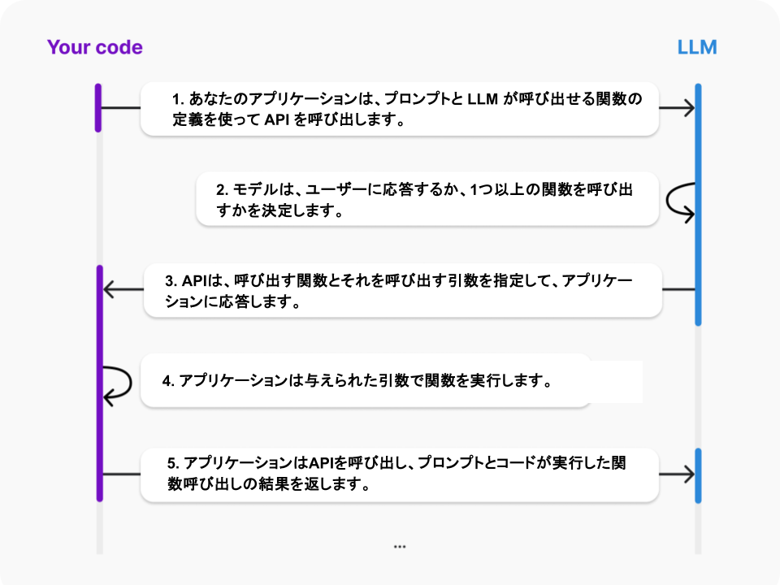

# 2.1 用語
- OpenAI: [function calling](https://platform.openai.com/docs/guides/function-calling)
- Anthropic: [tool use](https://docs.anthropic.com/en/docs/build-with-claude/tool-use)
- Google: [function calling](https://cloud.google.com/vertex-ai/generative-ai/docs/multimodal/function-calling)
- LangChain: [tool calling](https://python.langchain.com/docs/how_to/tool_calling/)

目的は同じですが、各製品で表記揺れがあります。

講義では、LangChainの場合は、tool callingと呼ぶつもりですが、function callingとtool callingは同じものを指すと思ってください

# 2.2 概要

> Function callingは、2023年6月にChat Completions APIに追加された機能です。簡単に言えば、 利用可能な関数を LLM に伝えておいて 、LLMに「関数を使いたい」という判断をさせる機能です(LLMが関数を実行するわけではなく、LLM は「関数を使いたい」という応答を返してくるだけです)

LangChainとLangGraphによるRAG_AIエージェント実践入門 より引用

下図の1.に当たります。

https://platform.openai.com/docs/guides/function-calling#lifecycle の図を日本語に翻訳

# 2.3 詳細
function_calling_basic.py を動かしてみてください。

# ref
- https://platform.openai.com/docs/guides/function-calling
- https://zenn.dev/pharmax/articles/1b351b730eef61#tool%E3%81%AE%E4%BD%9C%E3%82%8A%E6%96%B9
