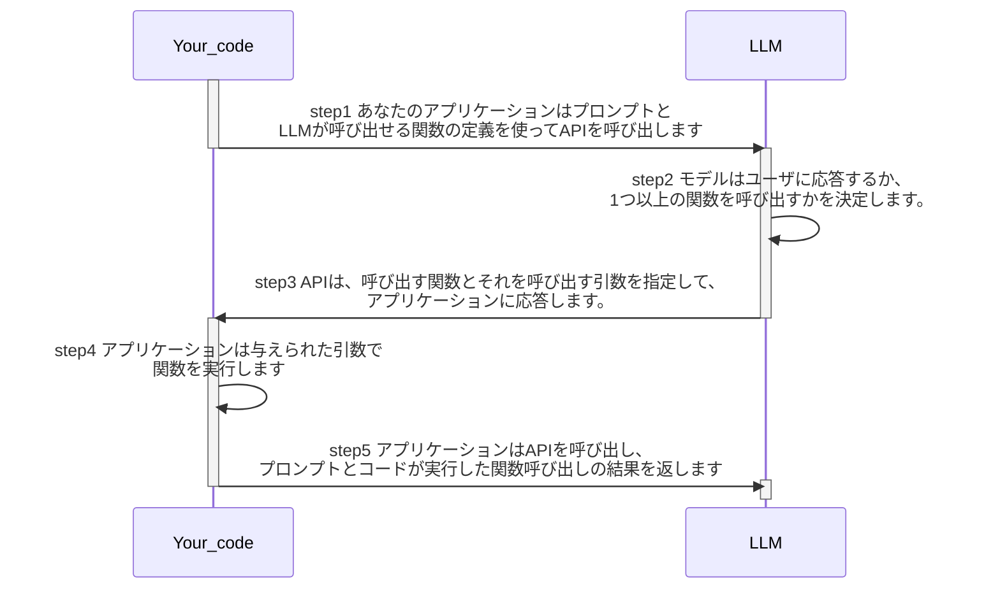
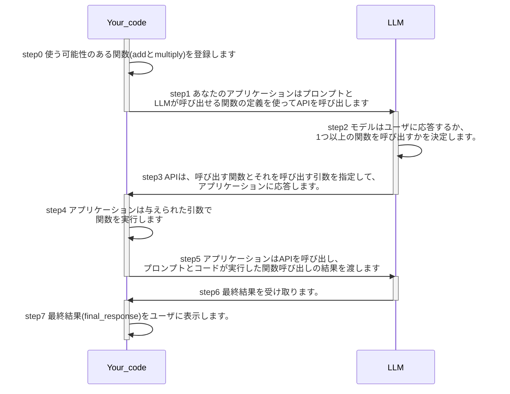

# 2. function calling の基本

## 2.1 用語

- OpenAI: [function calling](https://platform.openai.com/docs/guides/function-calling)
- Anthropic: [tool use](https://docs.anthropic.com/en/docs/build-with-claude/tool-use)
- Google: [function calling](https://cloud.google.com/vertex-ai/generative-ai/docs/multimodal/function-calling)
- LangChain: [tool calling](https://python.langchain.com/docs/how_to/tool_calling/)

目的は同じですが、各製品で表記揺れがあります。

講義では、LangChain の場合は、tool calling と呼ぶつもりですが、function calling と tool calling は同じものを指すと思ってください

## 2.2 function calling の概要

> Function calling は、2023 年 6 月に Chat Completions API に追加された機能です。簡単に言えば、 利用可能な関数を LLM に伝えておいて 、LLM に「関数を使いたい」という判断をさせる機能です(LLM が関数を実行するわけではなく、LLM は「関数を使いたい」という応答を返してくるだけです)

LangChain と LangGraph による RAG_AI エージェント実践入門 より引用

下図の step1, step2, step3 に当たります。

https://platform.openai.com/docs/guides/function-calling#lifecycle の図を日本語に翻訳

png の図が良い人は、[こちら](./img/function-calling-diagram-ja.png)を参照してください。

## 2.3 サンプルコード

function_calling_basics.py をきちんと対応させて書くと下記です。

# 2.4 実行

function_calling_basics.py を動かしてみてください。
ブレークポイントを貼りながら、LLM の返答を確認してみると理解が深まりやすいと思います。

# 参考文献

- https://platform.openai.com/docs/guides/function-calling
- https://zenn.dev/pharmax/articles/1b351b730eef61#tool%E3%81%AE%E4%BD%9C%E3%82%8A%E6%96%B9
- https://www.amazon.co.jp/dp/B0DK4YGYBL
